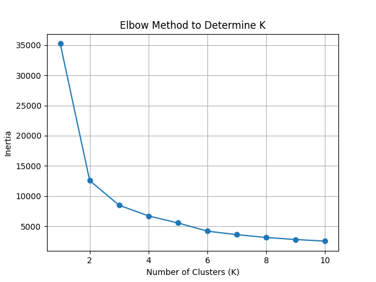
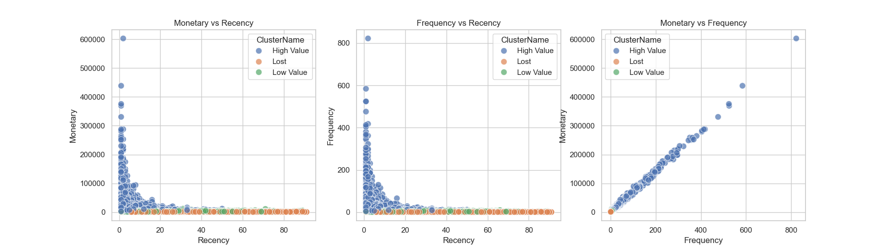

# 🎯 Customer Segmentation with RFM and K-Means

## 📘 Project Overview

This project segments customers from an Amazon sales dataset using **RFM analysis** and **K-Means clustering**. We clean the raw sales data, compute RFM metrics (Recency, Frequency, Monetary) for each customer, score them into quartiles, choose a cluster count using the elbow method, apply K-Means to group customers, and visualize the results.

## 📁 Project Structure

```plaintext
/data                -> Raw data (input)
/output              -> Processed files, plots, clusters
*.py                 -> Python scripts for each step
README.md            -> Project guide
requirements.txt     -> Dependencies list
```

## 📈 Visual Outputs

### 1. Elbow Method Plot

This plot helps us choose the optimal number of clusters for K-Means. The 'elbow' point (where the curve bends) is where adding more clusters doesn't significantly reduce error.



### 2. RFM Cluster Plot (3-in-1)

This combined plot shows how different customer segments compare across Recency, Frequency, and Monetary value. Each color represents a different customer group:

- Monetary vs Recency: High spenders who purchased recently
- Frequency vs Recency: Loyal repeat buyers
- Monetary vs Frequency: Consistent high spenders




## ⚙️ Steps and Scripts

### 1. Data Cleaning (`preprocess_data.py`)

* Loads `amazon_sale_report.csv`
* Removes nulls, zero qty/amount, and duplicates
* Parses `Date`, computes `UnitPrice`, and uses `ship-postal-code` as `CustomerID`
* Saves cleaned data to `output/processed_sales.csv`

### 2. RFM Metrics Calculation (`rfm_calculation.py`)

* Reads `processed_sales.csv`
* Sets snapshot date = last invoice date + 1 day
* Calculates:

  * **Recency** = days since last purchase
  * **Frequency** = number of invoices
  * **Monetary** = total amount spent
* Saves to `output/rfm_metrics.csv`

### 3. RFM Scoring (`rfm_scoring.py`)

* Reads `rfm_metrics.csv`
* Ranks each metric into percentiles and maps them to scores 1-4
* Saves to `output/rfm_scores.csv`

### 4. Choosing Clusters (`kmeans_elbow.py`)

* Reads RFM scores and calculates K-Means inertia for K=1 to 10
* Saves elbow plot to `output/elbow_plot.png`
* Pick the K where the elbow appears (in this case, K=3)

### 5. Apply K-Means (`kmeans_apply.py`)

* Sets `chosen_k = 3`
* Clusters using `R_Score`, `F_Score`, `M_Score`
* Labels clusters (e.g., High Value, Lost, Low Value)
* Saves to `output/rfm_clusters.csv`

### 6. Visualize Clusters (`simple_cluster_plot.py`)

* Generates scatterplots:

  * Monetary vs Recency
  * Frequency vs Recency
  * Monetary vs Frequency
* Saves 3-in-1 figure to `output/all_three_plots.png`

## ▶️ How to Run

1. Install requirements: `pip install -r requirements.txt`
2. Run scripts in order:

```
python preprocess_data.py
python rfm_calculation.py
python rfm_scoring.py
python kmeans_elbow.py  # View elbow_plot.png
# Update kmeans_apply.py with chosen_k = 3
python kmeans_apply.py
python simple_cluster_plot.py
```

3. View outputs in the `output/` folder

---

## 📝 Blog Article

Full walkthrough available here:

👉 https://medium.com/@anwarmohammedbasha/segmenting-customers-made-simple-with-rfm-and-k-means-ba396d93268f
